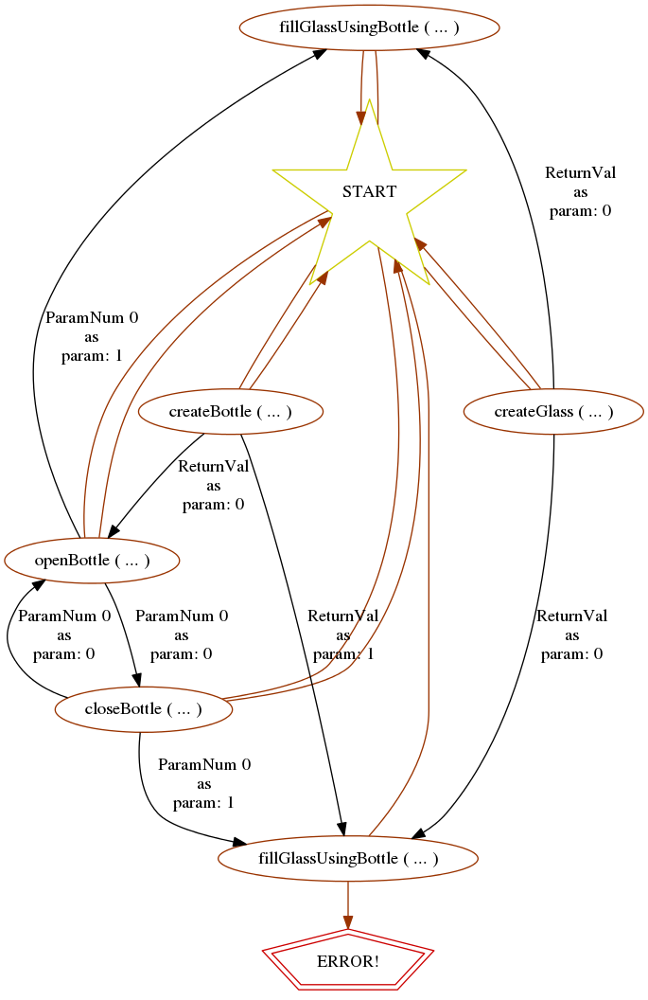

`detparaminf` - Parametrised Inference
======================================

`detparaminf` is a prototype of a learning algorithm that allows the inference of a regular languages with "parametrised symbols". It is based on the lessons learned with [James](https://github.com/palas/James) tool and is designed as an extension on the blue-fringe algorithm.

The key differences with James tool are that `detparaminf`:

* Is sound (it fits all input data).
* It works on grammar level (it can be used for test generation but it does not currently support automatic instrumentation and, thus, it does not assume that the system being modelled is a Web Service).


## Usage example

We can use `detparaminf` to infer a diagram from the following traces:

* Positive traces:
 * Trace 1:
    * B = createBottle()
    * G = createGlass()
    * openBottle(B)
    * fillGlassUsingBottle(G, B)
 * Trace 2:
    * B = createBottle()
    * G = createGlass()
    * openBottle(B)
    * closeBottle(B)
    * openBottle(B)
    * fillGlassUsingBottle(G, B)
* Negative traces:
 * Trace 3:
    * B1 = createBottle()
    * B2 = createBottle()
    * G = createGlass()
    * openBottle(B1)
    * fillGlassUsingBottle(G, B2)
 * Trace 4:
    * B = createBottle()
    * G = createGlass()
    * openBottle(B)
    * closeBottle(B)
    * fillGlassUsingBottle(G, B)
 
For that we first input the traces in the internal format. We can do it from `ghci` as follows:

```
import DetParamInf.ParamLang
let traces = ParamSample { posTraces = [[PCall "createBottle" [], PCall "createGlass" [], PCall "openBottle" [0], PCall "fillGlassUsingBottle" [1, 0]], [PCall "createBottle" [], PCall "createGlass" [], PCall "openBottle" [0], PCall "closeBottle" [0], PCall "openBottle" [0], PCall "fillGlassUsingBottle" [1, 0]]], negTraces = [[PCall "createBottle" [], PCall "createBottle" [], PCall "createGlass" [], PCall "openBottle" [0], PCall "fillGlassUsingBottle" [2, 1]], [PCall "createBottle" [], PCall "createGlass" [], PCall "openBottle" [0], PCall "closeBottle" [0], PCall "fillGlassUsingBottle" [1, 0]]] }
```

The inference algorithm is triggered by the function `detParamInf` in the `DetParamInf` module:

```
import DetParamInf.DetParamInf
let dfsm = detParamInf traces
```

We can now visualise the resulting machine as follows:

```
import DetParamInf.DFSMVisualise 
visualise dfsm
```
This will produce a diagram like the following:



The module `Inference` contains some functions to use oracles and some toy examples.


